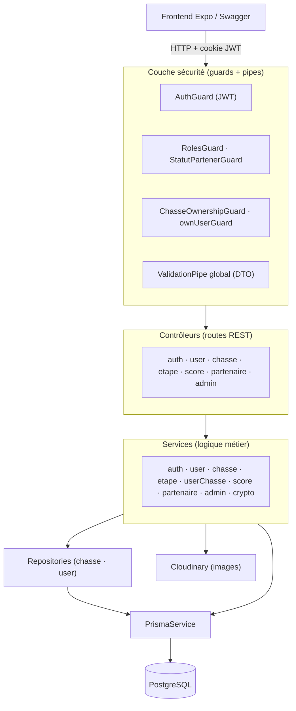
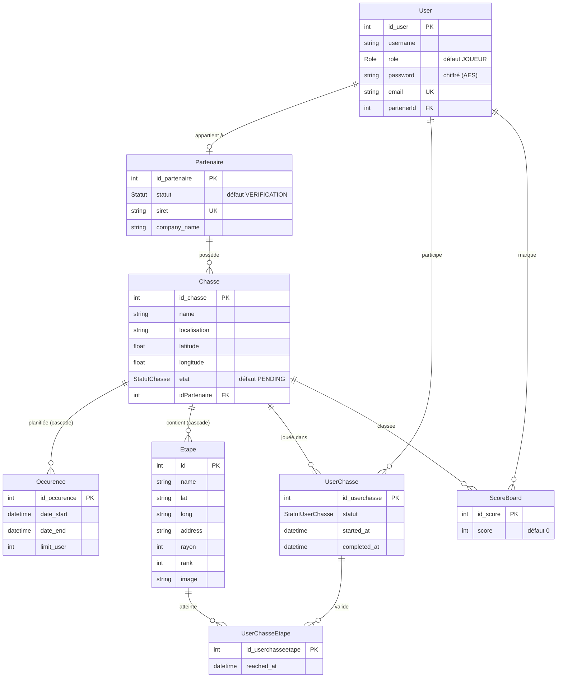
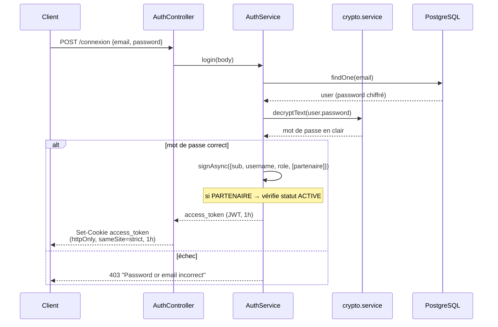
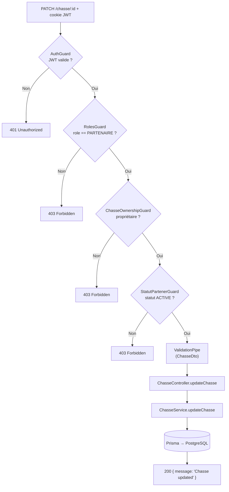
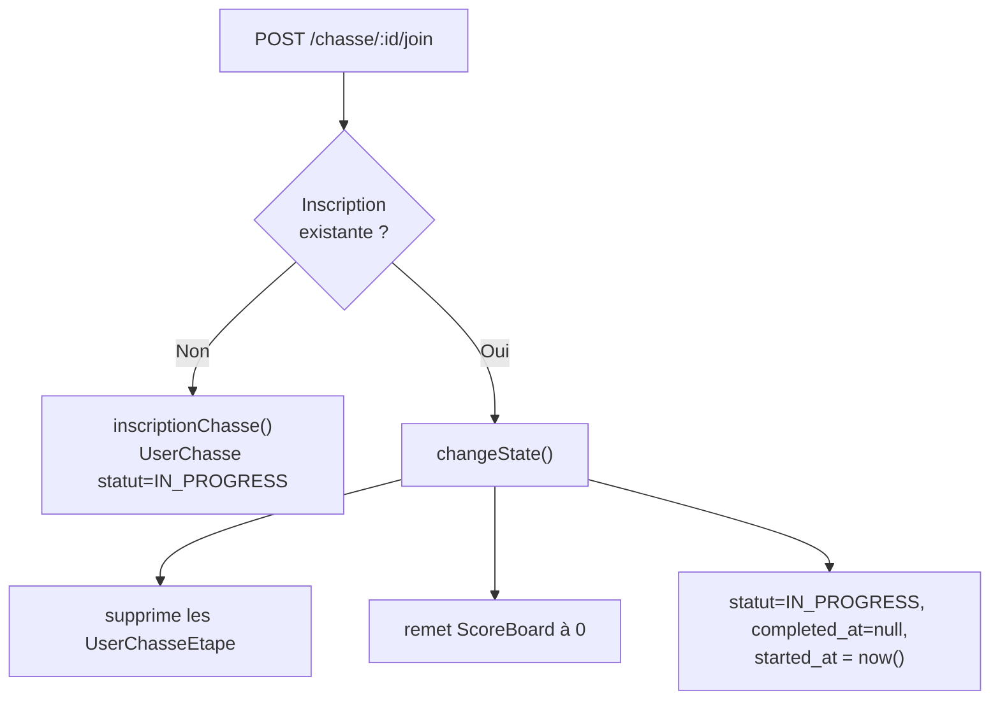
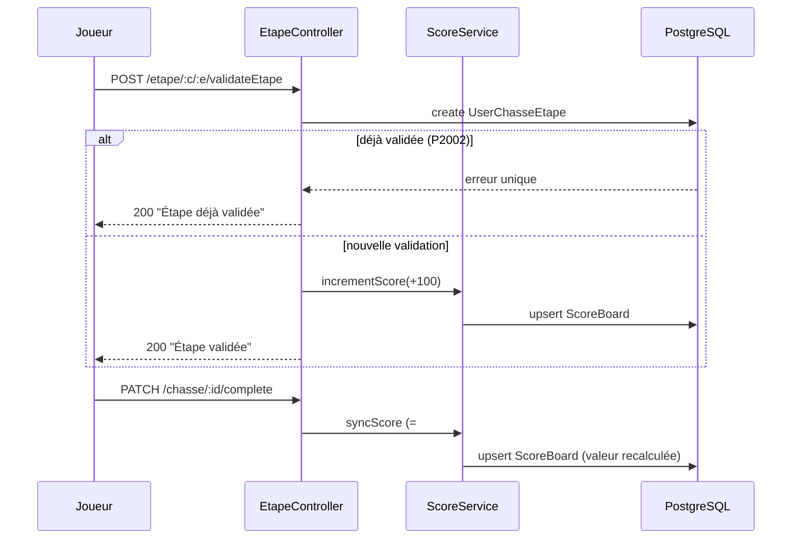
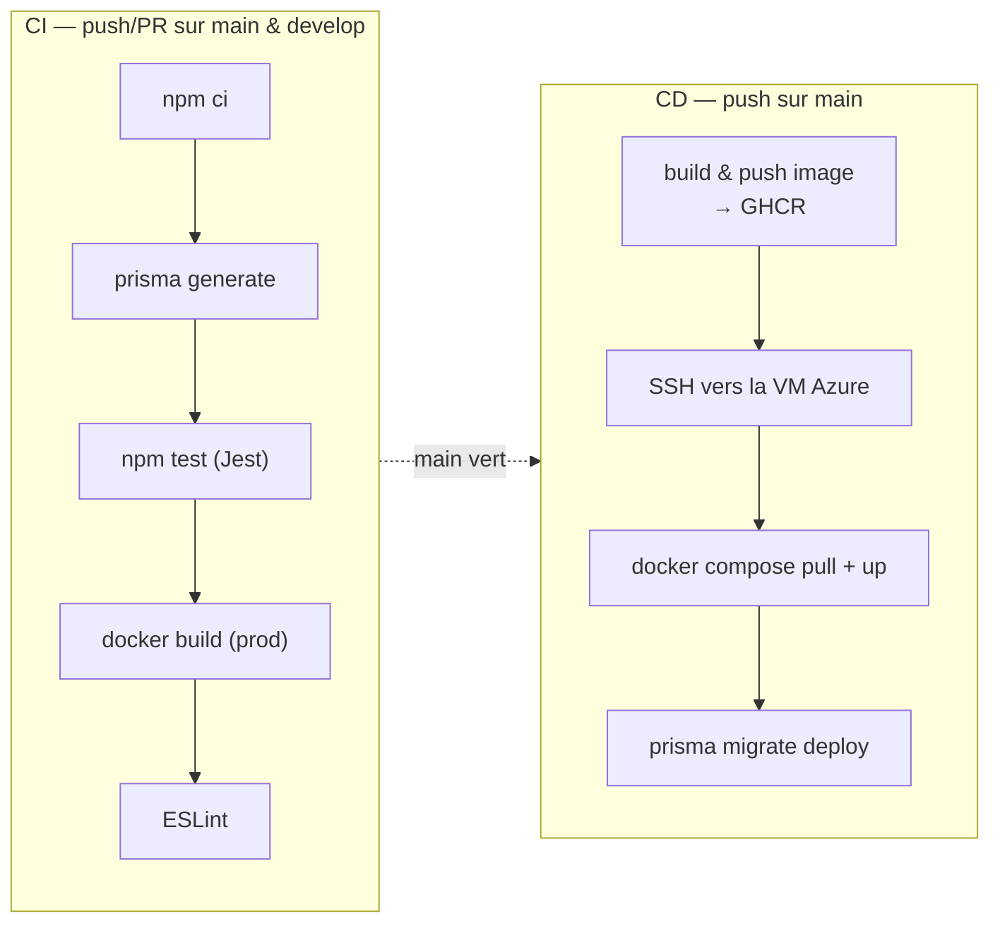

# 🗺️ Lootopia — Documentation technique du backend

> API REST **NestJS** de la plateforme de chasses au trésor Lootopia.
> Repository : `LootopiaJDA/backend` · Stack : NestJS 11 · Prisma 7 · PostgreSQL · TypeScript.

---

## Table des matières

- [🗺️ Lootopia — Documentation technique du backend](#️-lootopia--documentation-technique-du-backend)
  - [Table des matières](#table-des-matières)
  - [1. Vue d'ensemble](#1-vue-densemble)
  - [2. Stack technique](#2-stack-technique)
  - [3. Démarrage rapide](#3-démarrage-rapide)
    - [Scripts npm](#scripts-npm)
    - [Lancement via Docker (recommandé)](#lancement-via-docker-recommandé)
    - [Variables d'environnement](#variables-denvironnement)
  - [4. Architecture en couches](#4-architecture-en-couches)
  - [5. Structure du projet](#5-structure-du-projet)
  - [6. Bootstrap \& configuration](#6-bootstrap--configuration)
  - [7. Modèle de données (Prisma)](#7-modèle-de-données-prisma)
  - [8. Authentification \& chiffrement](#8-authentification--chiffrement)
    - [Connexion](#connexion)
    - [Chiffrement des mots de passe — `crypto.service.ts`](#chiffrement-des-mots-de-passe--cryptoservicets)
  - [9. Autorisation : guards \& décorateurs](#9-autorisation--guards--décorateurs)
  - [10. Cycle de vie d'une requête](#10-cycle-de-vie-dune-requête)
  - [11. Référence des endpoints](#11-référence-des-endpoints)
    - [🔑 Authentification — `/connexion`](#-authentification--connexion)
    - [👤 Utilisateurs — `/user`](#-utilisateurs--user)
    - [🧭 Chasses — `/chasse`](#-chasses--chasse)
    - [📍 Étapes — `/etape`](#-étapes--etape)
    - [🏆 Scores — `/scores`](#-scores--scores)
    - [🤝 Partenaires — `/partenaire`](#-partenaires--partenaire)
    - [🛡️ Administration — `/admin`](#️-administration--admin)
  - [12. Logique métier clé](#12-logique-métier-clé)
    - [12.1 Participation à une chasse](#121-participation-à-une-chasse)
    - [12.2 Validation d'étape \& score](#122-validation-détape--score)
    - [12.3 Classement](#123-classement)
  - [13. Upload d'images (Cloudinary)](#13-upload-dimages-cloudinary)
  - [14. Validation (DTO)](#14-validation-dto)
  - [15. Infrastructure : Docker \& base de données](#15-infrastructure--docker--base-de-données)
    - [`docker-compose.yml` (développement)](#docker-composeyml-développement)
    - [Dockerfiles](#dockerfiles)
    - [Prisma](#prisma)
  - [16. CI/CD](#16-cicd)
  - [17. Points d'attention \& dette technique](#17-points-dattention--dette-technique)
  - [18. Pistes d'amélioration](#18-pistes-damélioration)

---

## 1. Vue d'ensemble

Le backend Lootopia est une **API REST** qui sert le frontend mobile (React Native / Expo). Il gère :

- l'**authentification** par JWT stocké en cookie `httpOnly` ;
- la gestion des **utilisateurs** (joueurs, partenaires, administrateurs) ;
- le **cycle de vie des chasses** et de leurs **étapes** (CRUD, upload d'images) ;
- la **participation des joueurs** (inscription, validation d'étapes, complétion, abandon) ;
- le **système de score** et le **classement** par chasse ;
- la **modération** (validation des comptes partenaires, supervision).

Il expose une documentation **Swagger** interactive sur `/api`, persiste ses données dans **PostgreSQL** via **Prisma**, et héberge les images sur **Cloudinary**.

---

## 2. Stack technique

| Domaine | Technologie | Version |
|---|---|---|
| Framework | NestJS (`@nestjs/common`, `core`, `platform-express`) | `^11` |
| Langage | TypeScript | `^5.7` |
| ORM | Prisma (`@prisma/client`, `@prisma/adapter-pg`, `pg`) | `^7` |
| Base de données | PostgreSQL | `15` (Docker) |
| Authentification | `@nestjs/jwt` (JWT) | `^11` |
| Documentation API | `@nestjs/swagger` (OpenAPI) | `^11.2` |
| Validation | `class-validator` + `class-transformer` | — |
| Upload de fichiers | `multer` (`FileInterceptor`) | `^2` |
| Hébergement images | `cloudinary` | `^2.8` |
| Cookies | `cookie-parser` | `^1.4` |
| Chiffrement | `node:crypto` (`scrypt` + `aes-256-ctr`) | natif |
| Tests | `jest` + `ts-jest` + `supertest` | `^30` |
| Lint / format | ESLint + Prettier | — |

Runtime : **Node 20**. Le client Prisma est **généré dans le dépôt** (`src/generated/prisma`), via un *driver adapter* PostgreSQL (`PrismaPg`).

---

## 3. Démarrage rapide

### Scripts npm

```bash
npm install            # Dépendances
npm run start:dev      # Mode watch (développement)
npm run start:prod     # Production (node dist/src/main.js)
npm run build          # Build NestJS
npm test               # Tests Jest
npm run test:cov       # Couverture
npm run lint           # ESLint
npm run studio         # Prisma Studio (port 5555)
```

### Lancement via Docker (recommandé)

```bash
docker compose up --build
```

Démarre quatre services : l'API NestJS (`:3000`), PostgreSQL (`:5432`), PgAdmin (`:5050`) et Prisma Studio (`:5555`).

### Variables d'environnement

| Variable | Rôle |
|---|---|
| `DATABASE_URL` / `DATABASE_URL_DOCKER` | Chaîne de connexion PostgreSQL. |
| `JWT_SECRET` | Secret de signature des JWT. |
| `ENCRYPTION_PASSWORD` | Mot de passe servant à dériver la clé de chiffrement des mots de passe. |
| `API_KEY_CLOUDINARY` / `API_KEY_CLOUDINARY_SECRET` | Identifiants Cloudinary. |
| `NODE_ENV` | `development` / `production` (active `secure` sur le cookie en prod). |
| `POSTGRES_DB/USER/PASSWORD` · `PG_ADMIN_EMAIL/PASSWORD` | Config des conteneurs Postgres/PgAdmin. |

Au démarrage, l'application logue les URLs utiles (API, Swagger, PgAdmin, PostgreSQL, Prisma Studio).

---

## 4. Architecture en couches

Le backend suit l'architecture modulaire standard de NestJS, avec une séparation nette **contrôleur → service → (repository) → Prisma**, et une couche transversale de **guards** et **décorateurs** pour la sécurité.



Chaque domaine fonctionnel est un **module NestJS** (`app.module` agrège `User`, `Auth`, `Chasse`, `Partenaire`, `Etape`, `Admin`, `Score`). Les modules déclarent leurs contrôleurs, fournissent leurs services et exportent ce que les autres consomment (ex. `ChasseModule` exporte `ChasseService` pour le `ChasseOwnershipGuard`).

---

## 5. Structure du projet

```text
backend/
├── src/
│   ├── main.ts                     # Bootstrap : CORS, cookies, ValidationPipe, Swagger, Cloudinary
│   ├── module/                     # 8 modules NestJS (app + 7 domaines)
│   ├── controllers/                # 7 contrôleurs (routes REST)
│   │   ├── auth.controller.ts
│   │   ├── user.controller.ts
│   │   ├── chasse.controller.ts    #   le plus riche (CRUD + join/leave/complete)
│   │   ├── etape.controller.ts     #   CRUD étapes + validation joueur
│   │   ├── score.controller.ts
│   │   ├── partenaire.controller.ts
│   │   └── admin.controller.ts
│   ├── services/                   # 10 services (logique métier)
│   │   ├── auth.service.ts · user.service.ts · chasse.service.ts
│   │   ├── etape.service.ts · userChasse.service.ts · score.service.ts
│   │   ├── partenaire.service.ts · admin.service.ts
│   │   ├── crypto.service.ts       #   chiffrement des mots de passe
│   │   └── prisma.service.ts       #   client Prisma (lifecycle hooks)
│   ├── repository/                 # Accès données ciblé (chasse, user)
│   ├── guards/                     # 6 guards (auth, rôles, propriété, statut…)
│   ├── decorators/                 # @Roles, @Statuts, statut-chasse
│   ├── dto/                        # 6 DTO (validation + schéma Swagger)
│   ├── interface/                  # Types (RequestWithUser…)
│   ├── common/                     # ForbiddenException
│   └── generated/prisma/           # Client Prisma généré (committé)
├── prisma/
│   ├── schema.prisma               # Modèle de données
│   └── migrations/                 # init + add_scoreboard
├── docker-compose.yml              # backend + postgres + pgadmin + prisma-studio
├── dockerfile.dev / dockerfile.prod
├── .github/workflows/              # ci.yml (CI) + azure-webapps-node.yml (CD)
└── test/                           # Tests e2e
```

---

## 6. Bootstrap & configuration

Tout est configuré dans `src/main.ts` :

- **CORS** : `origin: true` (reflète l'origine), `credentials: true` (cookies), méthodes et en-têtes autorisés explicites.
- **`cookie-parser`** : permet de lire le JWT depuis le cookie `access_token`.
- **`ValidationPipe` global** : `transform: true`, `enableImplicitConversion: true` (conversion automatique des types), `forbidNonWhitelisted: true` (rejette les propriétés non déclarées dans le DTO).
- **Swagger** : documentation OpenAPI exposée sur **`/api`**, avec authentification *Bearer* (`access-token`).
- **Cloudinary** : configuré avec un `cloud_name` codé en dur (`dedqcxfgq`) et les clés issues de l'environnement.
- Écoute sur le **port 3000**.

---

## 7. Modèle de données (Prisma)

Source de vérité : `prisma/schema.prisma`. Quatre énumérations structurent la logique :

- `Role` : `ADMIN` · `PARTENAIRE` · `JOUEUR`
- `Statut` (partenaire) : `VERIFICATION` · `ACTIVE` · `INACTIVE`
- `StatutChasse` : `PENDING` · `ACTIVE` · `COMPLETED`
- `StatutUserChasse` : `IN_PROGRESS` · `COMPLETED` · `ABANDONED`



Points notables du schéma :

- **Contraintes d'unicité** : `User.email`, `Partenaire.siret`, et les couples `UserChasse(id_user, id_chasse)`, `UserChasseEtape(id_userchasse, id_etape)`, `ScoreBoard(id_user, id_chasse)`. Ces uniques garantissent qu'un joueur ne s'inscrit qu'une fois par chasse, ne valide une étape qu'une fois, et n'a qu'un score par chasse.
- **Cascades** : supprimer une `Chasse` supprime ses `Occurence` et `Etape`.
- **Index** sur les clés étrangères (`chasse_id`, `id_user`, `id_chasse`, `id_etape`…) pour les performances.
- **Particularité de nommage** : la clé primaire d'`Etape` s'appelle `id` (et non `id_etape` comme le reste). C'est précisément ce qui impose la normalisation côté frontend.
- Le modèle **`Message`** est défini mais **n'est utilisé par aucun service** (vestige / fonctionnalité à venir).

---

## 8. Authentification & chiffrement

### Connexion



- Le JWT (`@nestjs/jwt`) est signé avec `JWT_SECRET`, expire en **1 heure**, et porte le **payload** `{ sub, username, role }` — enrichi de `{ partenaire: { id_partenaire, statut } }` pour les partenaires.
- Le token est posé dans un cookie **`httpOnly`**, `sameSite: 'strict'`, `secure` en production, `maxAge` 1 h.
- Un **partenaire** ne peut se connecter que si son compte est `ACTIVE` (sinon `403 — en attente de validation`).
- La **déconnexion** (`GET /connexion/logout`) se contente d'effacer le cookie.

### Chiffrement des mots de passe — `crypto.service.ts`

Les mots de passe ne sont **pas hachés mais chiffrés de façon réversible** (AES-256-CTR) :

- une **clé** est dérivée de `ENCRYPTION_PASSWORD` via `scrypt` (mise en cache), avec un **sel fixe** (`'salt'`) ;
- `encryptText` produit `iv:ciphertext` (IV aléatoire de 16 octets) ;
- à la connexion, le mot de passe stocké est **déchiffré puis comparé en clair**.

> 🔒 **Point de sécurité majeur** (voir [§17](#17-points-dattention--dette-technique)) : un chiffrement réversible permet de retrouver les mots de passe en clair si la clé fuite. La pratique recommandée est un **hachage** dédié (bcrypt / argon2), non réversible.

---

## 9. Autorisation : guards & décorateurs

NestJS applique les guards dans l'ordre, en cascade. Le projet en définit six, pilotés par des décorateurs de métadonnées.

| Guard | Vérifie | Décorateur associé |
|---|---|---|
| `AuthGuard` | Présence + validité du JWT (cookie **ou** en-tête `Bearer`), attache `request.user`. | — |
| `RolesGuard` | Le rôle de l'utilisateur figure parmi ceux requis. | `@Roles(Role.…)` |
| `StatutPartenerGuard` | Le partenaire a un statut autorisé (ex. `ACTIVE`). | `@Statuts(Statut.…)` |
| `ChasseOwnershipGuard` | La chasse ciblée appartient bien au partenaire connecté (`chasse.idPartenaire === user.partenaire.id_partenaire`). | — |
| `ownUserGuard` | L'utilisateur agit sur **son propre** compte, ou est `ADMIN`. | — |
| `ActiveGuard` | *(inactif — voir dette technique)* | `statut-chasse` |

Exemple de composition sur la création d'étape : `AuthGuard` (niveau contrôleur) → `@Roles('PARTENAIRE')` + `ChasseOwnershipGuard` (niveau route). Un joueur authentifié mais non propriétaire de la chasse est ainsi bloqué à deux niveaux.

---

## 10. Cycle de vie d'une requête

Exemple : un partenaire met à jour une de ses chasses (`PATCH /chasse/:id`).



---

## 11. Référence des endpoints

> Toutes les routes (sauf `POST /connexion`, `POST /user`, `POST /user/partenaire`) exigent un JWT valide. Les rôles indiqués sont appliqués par `RolesGuard`.

### 🔑 Authentification — `/connexion`

| Méthode | Route | Accès | Description |
|---|---|---|---|
| `POST` | `/connexion` | public | Connexion, pose le cookie `access_token`. |
| `GET` | `/connexion/logout` | authentifié | Efface le cookie de session. |

### 👤 Utilisateurs — `/user`

| Méthode | Route | Accès | Description |
|---|---|---|---|
| `GET` | `/user/personnalData` | authentifié | Données du compte courant (sans mot de passe). |
| `POST` | `/user` | public | Création d'un joueur (mot de passe chiffré). |
| `GET` | `/user` | `ADMIN` | Liste de tous les utilisateurs. |
| `PUT` | `/user/:id` | soi-même / `ADMIN` | Mise à jour d'un utilisateur. |
| `POST` | `/user/partenaire` | public | Création d'un compte partenaire (statut `VERIFICATION`). |

### 🧭 Chasses — `/chasse`

| Méthode | Route | Accès | Description |
|---|---|---|---|
| `GET` | `/chasse?partenaire=&localisation=` | authentifié | Liste : par partenaire, ou toutes les chasses **ACTIVE** filtrées par localisation. |
| `GET` | `/chasse/me` | authentifié | Chasses du joueur (avec étapes validées). |
| `GET` | `/chasse/:id` | authentifié | Détail (nom, localisation, état, image, occurrence, étapes). |
| `POST` | `/chasse` | `PARTENAIRE` ACTIVE | Création (image → Cloudinary, transaction Chasse + Occurence). |
| `PATCH` | `/chasse/:id` | propriétaire ACTIVE | Mise à jour. |
| `DELETE` | `/chasse/:id` | propriétaire ACTIVE | Suppression. |
| `POST` | `/chasse/:id/join` | `JOUEUR` | Inscription, ou **redémarrage** si déjà inscrit (réinitialise étapes + score). |
| `PATCH` | `/chasse/:idChasse/leave` | `JOUEUR` | Abandon (`ABANDONED`). |
| `PATCH` | `/chasse/:id/complete` | `JOUEUR` | Complétion + synchronisation du score. |

### 📍 Étapes — `/etape`

| Méthode | Route | Accès | Description |
|---|---|---|---|
| `GET` | `/etape?idChasse=&idEtape=` | `JOUEUR` | Liste filtrée (toutes / une étape / par chasse / par chasse+étape). |
| `POST` | `/etape/:id` | propriétaire `PARTENAIRE` | Création d'étape (image → Cloudinary). |
| `PATCH` | `/etape/:idChasse/:idEtape` | propriétaire `PARTENAIRE` | Mise à jour (image optionnelle). |
| `DELETE` | `/etape/:idChasse/:idEtape` | propriétaire `PARTENAIRE` | Suppression (+ suppression de l'image Cloudinary). |
| `POST` | `/etape/:idChasse/:idEtape/validateEtape` | `JOUEUR` | Validation d'étape par le joueur (+100 points). |

### 🏆 Scores — `/scores`

| Méthode | Route | Accès | Description |
|---|---|---|---|
| `GET` | `/scores` | `JOUEUR` | Tous les scoreboards. |
| `GET` | `/scores/:idChasse` | `JOUEUR` | Classement d'une chasse (tri score décroissant, puis durée croissante). |
| `POST` | `/scores/:idChasse` | `JOUEUR` | Crée une entrée de score (à 0). |
| `PATCH` | `/scores/:idChasse` | `JOUEUR` | Incrémente le score (+100). |

### 🤝 Partenaires — `/partenaire`

| Méthode | Route | Accès | Description |
|---|---|---|---|
| `GET` | `/partenaire` | `ADMIN` | Liste des partenaires. |
| `PATCH` | `/partenaire/:id` | `ADMIN` | Met à jour le statut. |

### 🛡️ Administration — `/admin`

| Méthode | Route | Accès | Description |
|---|---|---|---|
| `GET` | `/admin/users` | `ADMIN` | Utilisateurs non-admin. |
| `PATCH` | `/admin/users/:id` | `ADMIN` | Mise à jour d'un utilisateur. |
| `POST` | `/admin/partenaire/:id/validate` | `ADMIN` | Validation d'un compte partenaire (`ACTIVE` / `INACTIVE`). |

---

## 12. Logique métier clé

### 12.1 Participation à une chasse

La route `POST /chasse/:id/join` joue deux rôles : **première inscription** ou **rejouer**. Si une inscription existe déjà, `changeState` réinitialise proprement la partie :



Les autres transitions de `UserChasse` : `leave` → `ABANDONED` ; `complete` → `COMPLETED` (+ horodatage `completed_at`).

### 12.2 Validation d'étape & score

Le `ScoreService` propose plusieurs stratégies de mise à jour, dont deux sont essentielles :

- **`incrementScore`** (appelée par `validateEtape`) : `upsert` qui ajoute **+100** à chaque étape validée. La validation crée un `UserChasseEtape` ; si l'étape était déjà validée, l'erreur d'unicité Prisma `P2002` est interceptée et renvoie « Étape déjà validée » (idempotence).
- **`syncScore`** (appelée par `complete`) : **recalcule** le score de façon autoritaire = `nombre d'étapes validées × 100`. C'est le mécanisme de **réconciliation** qui corrige toute dérive éventuelle entre les incréments et la réalité.



### 12.3 Classement

`getScoresByChasse` joint scores et participations pour calculer la **durée** (`completed_at − started_at`), puis trie par **score décroissant** et, à score égal, par **durée croissante** — le plus rapide est mieux classé.

---

## 13. Upload d'images (Cloudinary)

Les images (couverture de chasse, photo d'étape) sont reçues en **`multipart/form-data`** via l'intercepteur `FileInterceptor('image')` de Multer, puis :

1. converties en **data-URI base64** (`data:<mime>;base64,…`) ;
2. **uploadées** vers Cloudinary (`cloudinary.uploader.upload`) dans un dossier dédié (`chasses/` ou `etape/`), avec un `public_id` horodaté ;
3. seule l'**URL sécurisée** (`secure_url`) est persistée en base.

À la suppression d'une étape, le `public_id` est **réextrait de l'URL** par expression régulière puis l'image est détruite sur Cloudinary (`uploader.destroy`).

---

## 14. Validation (DTO)

Les corps de requête sont décrits par des **DTO** annotés `@ApiProperty` (Swagger) et, partiellement, par des décorateurs `class-validator` :

| DTO | Usage |
|---|---|
| `ConnexionDto` | Connexion (email, password). |
| `CreateUserDto` / `UpdateUserDto` | Création / mise à jour d'utilisateur. |
| `CreateUserPartenairDto` | Inscription partenaire (utilisateur + entreprise). |
| `ChasseDto` | Mise à jour de chasse. |
| `ChasseOccurrenceDto` | Création de chasse (étend `ChasseDto`, `occurrence` en JSON sérialisé). |
| `EtapeDto` | Étape (coordonnées, indice, rayon, rang, image binaire). |
| `OccurenceDto` | Sous-objet occurrence (dates + limite de participants). |

> Le `ValidationPipe` global rejette les champs non déclarés (`forbidNonWhitelisted`). En revanche, plusieurs champs n'ont **pas** de contrainte `class-validator` (ex. `ChasseDto.name`, `localisation`, `etat`) : la validation reste donc **partielle**.

---

## 15. Infrastructure : Docker & base de données

### `docker-compose.yml` (développement)

| Service | Image / build | Port | Rôle |
|---|---|---|---|
| `backend` | `dockerfile.dev` | `3000` | API NestJS en mode watch. |
| `postgres` | `postgres:15` | `5432` | Base de données (avec *healthcheck* `pg_isready`). |
| `pgadmin` | `dpage/pgadmin4` | `5050` | Interface d'administration PostgreSQL. |
| `prisma-studio` | `node:20` | `5555` | Explorateur de données Prisma. |

Réseau dédié `lootopia-network`, volume persistant `postgres_data`. Le backend attend que Postgres soit *healthy* avant de démarrer.

### Dockerfiles

- **`dockerfile.dev`** : `node:20-alpine`, installe toutes les dépendances, `prisma generate`, lance `start:dev`.
- **`dockerfile.prod`** : **multi-étapes** (builder + production) — build NestJS + `prisma generate` dans le builder, puis image finale allégée (`npm install --omit=dev`) exécutant `node dist/src/main.js`. Le client Prisma généré est recopié dans l'image finale.

### Prisma

- Schéma : `prisma/schema.prisma` ; client généré dans `src/generated/prisma` (via *driver adapter* `PrismaPg`).
- `PrismaService` étend `PrismaClient` et gère le cycle de vie (`onModuleInit` → `$connect`, `onModuleDestroy` → `$disconnect`).
- **Migrations** : `init` et `add_scoreboard`. En production, `prisma migrate deploy` est exécuté après déploiement.

---

## 16. CI/CD

Deux workflows GitHub Actions orchestrent l'intégration et le déploiement.



- **CI** (`ci.yml`) : checkout → Node 20 → `npm ci` → `prisma generate` → tests Jest → build de l'image Docker de production → lint. Les secrets (`DATABASE_URL`, `JWT_SECRET`, `ENCRYPTION_PASSWORD`) sont injectés via les *secrets* GitHub.
- **CD** (`azure-webapps-node.yml`) : sur `main`, construit et pousse l'image vers **GitHub Container Registry** (`ghcr.io/lootopiajda/lootopia-backend`), puis se connecte en **SSH à une VM Azure**, fait un `docker compose pull && up` et applique les migrations Prisma.

> C'est cette VM Azure qui correspond à l'**IP de secours codée en dur** (`20.46.53.133:3000`) du frontend.

---

## 17. Points d'attention & dette technique

Éléments à connaître avant de reprendre le projet, par ordre d'importance :

- 🔴 **Mots de passe chiffrés (réversibles), pas hachés.** `crypto.service` utilise AES-256-CTR ; un mot de passe peut être retrouvé en clair si `ENCRYPTION_PASSWORD` fuit. À remplacer par bcrypt/argon2. De plus, le **sel scrypt est fixe** (`'salt'`), ce qui affaiblit la dérivation de clé.
- 🔴 **Secrets / valeurs codés en dur.** Le `cloud_name` Cloudinary (`dedqcxfgq`) est en dur dans `main.ts`.
- 🟠 **Logout non révocant.** La déconnexion n'efface que le cookie ; le JWT reste valable jusqu'à expiration (pas de liste de révocation). Combiné à une durée de vie de **1 h sans refresh token**, l'UX de session est limitée.
- 🟠 **Fuite d'erreurs au client.** Plusieurs handlers renvoient l'objet `error` brut (`res.status(500).send(error)`), ce qui peut exposer des détails internes (stack, requêtes). Préférer des `HttpException` au message maîtrisé.
- 🟠 **Validation partielle.** Malgré `forbidNonWhitelisted`, de nombreux champs de DTO n'ont pas de décorateur `class-validator` (types, formats, bornes non vérifiés).
- 🟡 **`ActiveGuard` est du code mort** : il lit un décorateur mais ne fait rien et retourne toujours `true`.
- 🟡 **Modèle `Message` inutilisé** dans le schéma Prisma.
- 🟡 **Logique de score dispersée** entre `score.controller` (PATCH +100), `etape.validateEtape` (+100) et `complete` (sync). Le risque de double comptage est atténué par `syncScore`, mais la cohabitation de ces chemins reste fragile.
- 🟡 **Incohérence de nommage** : la PK d'`Etape` est `id` au lieu de `id_etape`, ce qui impose une normalisation côté client.
- 🟡 **`ApiBearerAuth('access-token')` sans `@`** dans `score.controller.ts` : l'appel est sans effet (le décorateur n'est pas appliqué).
- 🟡 **Paramètre mort** : à la création de chasse, le `chasse.connect` passé pour l'occurrence est ignoré par le service (qui relie à la chasse fraîchement créée dans une transaction).
- ⚪ **Métadonnées** : `package.json` nommé `lootopia-temp`, licence `UNLICENSED`, un seul contributeur.
- ⚪ **Tests quasi inexistants** : seul un `app.controller.spec.ts` est présent, malgré une configuration Jest complète et une étape `npm test` en CI.

---

## 18. Pistes d'amélioration

- **Sécuriser l'authentification** : passer au hachage (argon2/bcrypt) avec sel aléatoire par utilisateur ; ajouter un **refresh token** et une stratégie de révocation.
- **Externaliser la configuration** : `@nestjs/config` pour valider les variables d'environnement au démarrage et supprimer les valeurs en dur (Cloudinary).
- **Uniformiser la gestion d'erreurs** : un *exception filter* global renvoyant des réponses normalisées, sans exposer les erreurs brutes.
- **Compléter les DTO** avec `class-validator` (longueurs, formats email/SIRET, énumérations) pour une validation réellement stricte.
- **Consolider le score** : un seul point d'entrée (la validation d'étape) + `syncScore` comme garde-fou ; retirer les routes/incréments redondants.
- **Nettoyer le code mort** : `ActiveGuard`, modèle `Message`, paramètres ignorés, décorateur Swagger non appliqué.
- **Renforcer la suite de tests** : tests unitaires des services (score, userChasse, crypto), tests e2e des parcours d'autorisation (rôles, propriété).
- **Documenter les variables d'environnement** dans un `.env.example` versionné.

---

*Documentation générée à partir d'une analyse du code source (branche `main`).*